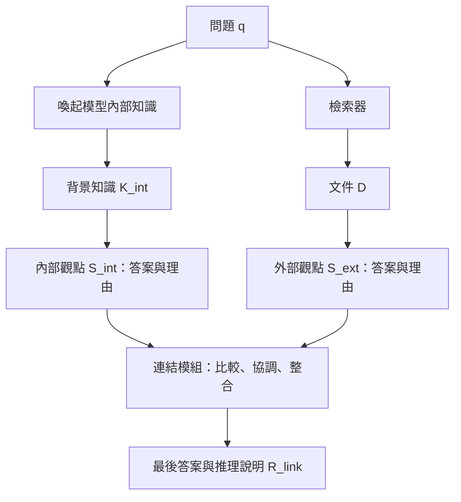

# IDEAL-RAG：數學理解與閱讀筆記

本筆記依使用者提供的論文編寫。標示「原式」者對應論文；標示「教學展開」「示意」者是為理解而增加的說明，不是作者額外提出的方法。正文頁碼加 9 即為 PDF 頁碼。

## 1. 先掌握核心問題

這篇研究問的是：**模型自己記得的內容，與剛查到的文件不一致時，怎麼降低被錯誤文件帶走的機率？**

一般 RAG 的輸入可以想成「問題＋查到的文件」。IDEAL-RAG 多做三件事：

1. 先讓模型寫出自己記得的背景知識。
2. 內部知識與外部文件各自形成答案及理由。
3. 再讓模型比較兩份理由，形成最後答案。

此圖是概念簡圖，未畫出傳入各模組的問題、原始來源內容與少樣本示例。兩個「觀點」是來源與提示分離，不等於兩個不同模型，也不保證統計獨立；同一模型可能在兩邊重複相同偏誤。

**全文沒有一個已明確列出的最佳融合係數，例如「內部占 0.7、外部占 0.3」。** 這裡的對齊主要由提示引導或微調後的語言模型生成完成。因此理解第 3 章時，應先把公式當成資料流程，而不是某個封閉形式的數學證明。

## 2. 符號翻譯表

| 符號 | 名稱 | 可以怎麼想 |
|---|---|---|
| $q$ | 問題 | 題目本身 |
| $a$ | 標準答案 | 批改用的正確答案 |
| $D$ | 檢索段落集合 | 剛查到的資料 |
| $T$ | 大型文字庫 | 可供搜尋的所有文件 |
| $C$ | 問答資料集 | 很多組「題目、答案、文件」 |
| $K_{\mathrm{int}}$ | 萃取的內部知識 | 模型先寫出的背景筆記 |
| $S_{\mathrm{int}}$ | 內部觀點 | 根據背景筆記提出的答案與理由 |
| $S_{\mathrm{ext}}$ | 外部觀點 | 根據檢索文件提出的答案與理由 |
| $R_{\mathrm{link}}$ | 連結推理說明 | 比較雙方後的整合說明，含最終答案 |
| $E_{\mathrm{int}}$ | 知識萃取操作 | 用「請回想背景」提示呼叫模型 |
| $G$ | 觀點生成操作 | 用「請依此來源立論」提示呼叫模型 |
| $L$ | 連結生成操作 | 用「請比較雙方」提示呼叫模型 |
| $\Theta_0$ | 凍結模型參數 | 尚未為這個任務更新的模型權重 |
| $\Theta_{\mathrm{link}}$ | 微調後參數 | 學過連結推理示範的模型權重 |
| $B_{\mathrm{int}},B_{\mathrm{ext}},B_{\mathrm{link}}$ | 三種示例庫 | 給模型看的範例 |
| $\star$ | 種子／目標生成標記 | 多見於答案可見的示例構建；不代表絕對正確 |
| $\hat{\ }$ | 預測標記 | 答案未知時由模型自行生成 |
| $\widetilde{\ }$ | 擾動標記 | 被污染或修改過的資料 |
| $\ell$ | 層索引 | Transformer 的第幾層 |
| $t\in\mathrm{Ans}$ | 答案 token | 答案序列中的 token 位置，不應去除重複 token |
| $\Delta$ | 變化量 | 此文依各指標有不同定義，不能一概視為相減 |

$f(x;\Theta)$ 可以讀成：「**使用參數是 $\Theta$ 的模型，對輸入 $x$ 執行操作 $f$。**」分號只是在寫法上區分資料與模型設定，不是額外數學運算。

token 是模型處理文字的單位，可能是字、詞或詞的一部分。不要假設一個中文字或英文單字永遠等於一個 token。

## 3. 式 3.1–3.9、3.11：把流程寫成公式

### 式 3.1：資料集長什麼樣？（正文第 12 頁）

$$C=\{(q_i,a_i,D_i)\}_{i=1}^{N}.$$

讀成：共有 $N$ 筆資料，每筆都包含問題、正確答案、檢索段落。$i$ 只是第幾筆；大括號表示把這些資料收集起來。

**教學例：** $q_i$ 是「法國首都是哪裡？」、$a_i$ 是「巴黎」、$D_i$ 是查回的數個段落。這不是在做運算，只是在定義資料格式。

### 式 3.2：答對比例怎麼算？（正文第 12 頁）

$$\mathrm{Acc}=\frac{1}{|C_{\mathrm{test}}|}\sum_{(q,a)\in C_{\mathrm{test}}}\mathbf1[a\subseteq R,\ R=\mathrm{IDEAL}(q,D)].$$

- $|C_{\mathrm{test}}|$：測試題數，例如 100 題。
- $\mathbf1[\text{條件}]$：條件成立算 1，不成立算 0。
- $\sum$：把每題的 0 或 1 加起來。
- 除以題數：得到答對比例，例如 $73/100=0.73=73\%$。

原文稱 EM，但第 4.1.3 節實際規則是：**最終答案區段包含任一參考答案字串，即計為正確。**

所以這裡的 $a\subseteq R$ 意思是文字包含，不是嚴格的集合包含。假設參考答案是「巴黎」，輸出「答案是巴黎」可能算對，雖然兩串文字不完全相等。這種規則也可能讓同時羅列多個候選答案的輸出獲分，因此要看實際答案擷取與正規化程式。

更清楚的教學寫法是：

$$\mathrm{Acc}=\frac1N\sum_{i=1}^N\mathbf1\!\left[\exists a\in A_i:\ a\text{ 出現在最終答案 }\hat a_i\text{ 中}\right].$$

其中 $A_i$ 是第 $i$ 題可接受的答案及別名集合。這是語意重寫，不是原文新公式。

### 式 3.3 與 3.6：先回想背景（正文第 12、13 頁）

$$K_{\mathrm{int}}^\star=E_{\mathrm{int}}(q;\Theta_0),\qquad K_{\mathrm{int}}=E_{\mathrm{int}}(q;\Theta_0).$$

讀成：「模型只看到問題，先產生背景知識。」

此步驟沒有把正確答案 $a$ 或檢索文件 $D$ 放進公式。即使 $K^\star$ 帶星號，式 3.3 的萃取輸入仍只有問題；不能因星號就以為它讀過答案。

更精確地說，這不是直接從權重中讀出一個可靠資料庫，而是**用模型參數生成一段被當作內部知識的文字**。這段文字也可能不完整或錯誤。

### 式 3.4：有答案時，製作兩種示範（正文第 13 頁）

$$S_{\mathrm{int}}^\star=G(q,a,K_{\mathrm{int}}^\star;\Theta_0),\qquad S_{\mathrm{ext}}^\star=G(q,a,D;\Theta_0).$$

內部支線看到「題目、答案、背景筆記」；外部支線看到「題目、答案、檢索資料」。兩邊各自解釋來源如何支持某個答案。

要注意原提示允許：如果來源不支持給定答案，該支線可以提出來源支持的另一個答案。這是為了保留來源的衝突，讓下一階段有內容可比較。

此時讓模型看到答案，是在做訓練示例或示範資料。**是否構成資料洩漏，要看是否把測試題的答案放進生成該測試答案的輸入。** 不能把所有 answer-seen 都叫作弊，也不能忽略種子集與測試集是否確實分離。

### 式 3.5：存入示例庫（正文第 13 頁）

$$B_{\mathrm{int}}\leftarrow S_{\mathrm{int}}^\star,\qquad B_{\mathrm{ext}}\leftarrow S_{\mathrm{ext}}^\star.$$

就是「把剛寫好的示範收起來」。原文是演算法式簡寫，不表示把整個示例庫覆蓋成最後一筆。在完整實作中，示例還應包含必要的題目與來源上下文，讓模型理解該理由對應什麼輸入。

### 式 3.7：測試時照著範例立論（正文第 15 頁）

$$\hat S_{\mathrm{int}}=G(q,K_{\mathrm{int}};\Theta_0,\mathrm{ICE}=B_{\mathrm{int}}),$$
$$\hat S_{\mathrm{ext}}=G(q,D;\Theta_0,\mathrm{ICE}=B_{\mathrm{ext}}).$$

相比式 3.4，有兩個改變：不再提供這一題的標準答案 $a$；改為提供其他題目的示例。ICE 就是放進上下文的示例。

這是 ICL：**看範例後當場回答，但不更新模型權重。** 不是把示例永久寫入模型。

### 式 3.8：教模型怎麼協調（正文第 17 頁）

此式的核心是：提供題目、標準答案、兩種來源及雙方觀點，請模型產生「哪些說法支持正解、哪些應拒絕」的連結推理，再存入 $B_{\mathrm{link}}$。

原式寫的是 $B_{\mathrm{int}},B_{\mathrm{ext}}$，演算法對應處則是當題的 $S_{\mathrm{int}}^\star,S_{\mathrm{ext}}^\star$。不要被混用記號卡住：核心是在**已知答案下生成整合示範**。

此過程有「先知答案，再解釋答案」的成分。因此產生的 rationale 是訓練用說明，不保證忠實反映模型在未知答案時真正如何決策。

### 式 3.9 與 3.11：ICL 與 SFT 的差別（正文第 18–19 頁）

| 路徑 | 測試時模型權重 | 是否附連結示例 | 當題標準答案 |
|---|---|---|---|
| 式 3.9，ICL | 原模型 $\Theta_0$ | 有 | 不提供 |
| 式 3.11，SFT | 微調模型 $\Theta_{\mathrm{link}}$ | 無須 ICE | 不提供 |

ICL 像「考試時附上示範題」；SFT 像「先用示範練習並調整作答習慣，考試時不再附範例」。兩者仍需要當題的來源材料與觀點。

## 4. 式 3.10：訓練到底在最小化什麼？（正文第 19 頁）

原式的本質是負對數似然最小化。把原文不整齊的資料集索引整理後，可讀成：

$$\Theta_{\mathrm{link}}=\arg\min_\Theta\sum_i-\log p_\Theta(R_i^\star\mid x_i),$$

其中 $x_i$ 代表第 $i$ 筆的問題、檢索資訊與雙觀點等完整提示；$R_i^\star$ 是希望模型學會的連結推理文字。

逐項理解：

- $p_\Theta(R_i^\star\mid x_i)$：在輸入 $x_i$ 下，模型給這份目標推理文字的機率。
- $\log$：取對數，將機率的連乘變成相加，較方便訓練。
- 負號：目標文字機率越大，損失越小。
- $\sum_i$：希望整批訓練資料都表現好。
- $\arg\min_\Theta$：找出讓總損失最小的參數設定，不是回傳最小損失值本身。

**單步數字例，採自然對數：**

| 模型給目標 token 的機率 | 損失 $-\ln p$ |
|---:|---:|
| 0.10 | 2.303 |
| 0.50 | 0.693 |
| 0.90 | 0.105 |

給正確目標越高機率，懲罰越小。

**教學展開：一整段推理怎麼算機率？**

假設目標序列是 $R^\star=(r_1,r_2,\ldots,r_m)$，自回歸模型逐 token 計算：

$$p_\Theta(R^\star\mid x)=\prod_{j=1}^m p_\Theta(r_j\mid x,r_{<j}),$$

因此：

$$-\log p_\Theta(R^\star\mid x)=-\sum_{j=1}^m\log p_\Theta(r_j\mid x,r_{<j}).$$

若三個目標 token 的條件機率是 0.5、0.8、0.25，整段機率為 $0.5\times0.8\times0.25=0.1$，負對數似然為 $-\ln0.1\approx2.303$。這與分別計算三個負對數後相加相同。

訓練通常以目標前綴 $r_{<j}$ 來預測下一個 token，即 teacher forcing。這個目標是在學習**生成示範文字**，不是直接把「真實正確性」「證據可信度」或「CSS」當作損失。

因此：

- 示範推理品質不佳，模型也可能學到不佳的說明模式。
- 損失下降不保證所有問題都答對。
- 這篇沒有在式 3.10 加上 CSS、PKS 或額外數學對齊損失。

實作採 LoRA，主要更新低秩適配參數。可以理解為不改動所有原權重，而學習較小的更新量；公式的 $\Theta$ 是可訓練參數的概括寫法，不能據此認定採全參數微調。

## 5. 式 4.1：如何把檢索弄髒？（正文第 21 頁）

$$\widetilde D=\mathcal N(D).$$

讀成：「把原檢索文件 $D$ 經過污染操作 $\mathcal N$，得到被修改的文件 $\widetilde D$。」原式後面的聯集列出三類雜訊，是概念分類，並沒有給出完整的機率生成模型。

**教學例：** 五個段落中，只有第 1、2、3、4 個包含正確答案「巴黎」。

- Counter-Mix：把其中兩個含答案段落的「巴黎」換成某個錯誤城市，另外兩個保留。
- Counter-All：四個含答案段落都修改。
- 第 5 個原本不含答案的段落不一定修改。

所以 Counter-All 不是「五篇文章的每個字都變成假的」，也不等於所有真實世界攻擊。它主要測量模型對答案實體被替換的抵抗能力。

## 6. 式 4.2：ADR 是「掉了多少原本的準確率」（正文第 22 頁）

$$\mathrm{ADR}=\frac{\mathrm{EM}_{\mathrm{clean}}-\mathrm{EM}_{\mathrm{cf}}}{\mathrm{EM}_{\mathrm{clean}}}\times100\%.$$

**教學例：** 同一批題目，乾淨資料答對 80%，污染後答對 60%。

$$\mathrm{ADR}=\frac{80-60}{80}\times100\%=25\%.$$

意思是原有準確率淨損失四分之一。它不是「掉 25 個百分點」；準確率本身掉的是 20 個百分點。

**用論文數字驗算：** 表 5.3 的 NQ、IDEAL-RAG、一般資料訓練、Counter-All：

$$\frac{83.60-55.48}{83.60}\times100\%\approx33.64\%.$$

注意乾淨分母是 **83.60**，不是表 4.2 的整體乾淨分數 **63.71**。兩者對應的題目範圍不同。污染測試先挑出能替換答案的題目，必須以同一批題目在未修改時的表現當基準。

這也解釋了為什麼某些表格中，污染分數看起來高於整體乾淨分數：題目子集本來就不同，不能解讀成污染有益。

**ADR 不完全等於「原本答對後來答錯」的比例。**

設 $n_{cw}$ 是乾淨時對、污染後錯的題數；$n_{wc}$ 是乾淨時錯、污染後對的題數；$n_c$ 是乾淨時答對總數。在相同測試集合上，原式可重寫為：

$$\mathrm{ADR}=\frac{n_{cw}-n_{wc}}{n_c}\times100\%.$$

若你真正要測的是「原先答對題目的失敗比例」，應用：

$$\frac{n_{cw}}{n_c}\times100\%.$$

只有 $n_{wc}=0$ 時兩者相同。例：原先答對 80 題，有 30 題變錯、10 題由錯變對，最後仍答對 60 題；ADR 是 25%，但原本答對題目的失敗比例是 $30/80=37.5\%$。

此外，乾淨準確率為零時，ADR 無法定義；污染後準確率較高時，ADR 可為負值。ADR 低也不保證絕對準確率高，例如一直只有 10% 準確率的模型，也可能 ADR 接近零。

## 7. 式 4.3：CSS 是「答案機率被文件改動了多少」（正文第 22 頁）

$$\Delta\mathrm{CSS}=\sum_{t\in\mathrm{Ans}}\left|\log p_{\mathrm{clean}}(t)-\log p_{\mathrm{cf}}(t)\right|.$$

這裡比較的是**答案 token 的機率**，不是只比模型最後印出的文字。模型輸出相同文字，也可能有不同機率。

如果答案簡化為一個 token，乾淨情境機率為 0.8，污染後為 0.2：

$$\Delta\mathrm{CSS}=|\ln0.8-\ln0.2|=|\ln4|\approx1.386.$$

若另一個方法從 0.8 變成 0.75：

$$|\ln0.8-\ln0.75|=|\ln(0.8/0.75)|\approx0.065.$$

後者機率較不受污染影響。取 log 的效果是比較機率的「倍數改變」；0.8 降到 0.4，與 0.2 降到 0.1，單 token 的絕對對數差同為 $\ln2$。

**為什麼有絕對值？** 不管機率上升或下降都算變化。0.8 → 0.2 與 0.2 → 0.8 得到相同分數。因此此式量的是敏感度，不單是信心下降，也不能直接判斷依賴外部資訊的方向。

**為什麼加總？** 答案可能有多個 token。假設兩個位置的絕對對數差為 0.3 與 0.5，總 CSS 為 0.8。

這是「先取每項絕對值再相加」，不是「相加後才取絕對值」：

$$\sum_j|u_j|\ne\left|\sum_j u_j\right|\quad\text{一般情況下。}$$

如果一個 token 上升、另一個下降，原式不讓兩者抵銷。

**CSS 的三個閱讀限制：**

1. **穩定不等於正確。** 模型對正確答案始終只給 0.01，乾淨、污染都一樣，CSS 仍然是零。也可能是模型完全忽略文件。
2. **總和受答案長度影響。** 原式未除以 token 數。比較不同問題、不同長度答案時，要注意此混淆；改成平均會是另一個版本，不能說原文已如此做。
3. **必須對齊計分序列。** 論文沒有充分交代 Ans 是標準答案還是生成答案、如何處理不同前綴。嚴謹比較可固定同一答案序列及前綴，用兩種上下文重新計分，但這是重現建議，不是已確認的原實作。

按式 4.3，$\Delta\mathrm{CSS}\ge0$。圖 4.1 延伸到負值，因此應核對實作是否使用帶符號差、或僅是小提琴密度估計延伸；不要把圖中的負值直接當作該公式的合法結果。

## 8. 式 4.4：PKS 是「經過 FFN 後，詞彙分布改變多少」（正文第 22–23 頁）

$$\mathrm{PKS}_{\ell,t}=\mathrm{JSD}\!\left(\mathrm{softmax}(W_U\mathrm{LN}(h_{\ell,t}^{\mathrm{mid}})),\mathrm{softmax}(W_U\mathrm{LN}(h_{\ell,t}^{\mathrm{out}}))\right).$$

先不要從最外層硬背，從最裡面往外看。

### 第一步：取得 FFN 前後的隱藏狀態

$h_{\ell,t}^{\mathrm{mid}}$ 是該層進入 FFN 前，對該位置的內部向量；$h_{\ell,t}^{\mathrm{out}}$ 是 FFN 結果加回殘差後的向量。

可用以下示意理解，省略正規化等架構細節：

$$h^{\mathrm{out}}=h^{\mathrm{mid}}+\mathrm{FFN}(h^{\mathrm{mid}}).$$

把殘差流想成逐層修改的工作筆記；FFN 在這一層提供一筆更新。這是比喻，不是說模型內部真的有文字筆記。

### 第二步：把內部向量轉成可比較的詞彙分布

$\mathrm{LN}$ 代表原文寫法中的正規化操作；$W_U$ 是將隱藏向量投影到詞彙表分數的輸出矩陣；softmax 把分數轉成機率分布。

若 logits 為 $z_1,\ldots,z_V$，教學定義為：

$$\mathrm{softmax}(z)_v=\frac{e^{z_v}}{\sum_{u=1}^{V}e^{z_u}}.$$

結果每項非負，總和為 1。分數越大，對應詞的機率越高。

這種從中間層投影出詞彙分布的方法，稱為 logit lens。投影結果是探測用的中間層分布，不必然是模型最後真正輸出的分布。論文以 LN 表示正規化；重現時應依骨幹實際模組處理，不能只看符號就假設所有模型都用相同 LayerNorm。

### 第三步：用 JSD 比較兩份分布

令：

$$P=\mathrm{softmax}(W_U\mathrm{LN}(h^{\mathrm{mid}})),\qquad Q=\mathrm{softmax}(W_U\mathrm{LN}(h^{\mathrm{out}})).$$

則 PKS 就是 $\mathrm{JSD}(P,Q)$。

**教學展開：** Jensen–Shannon 散度的定義為：

$$M=\frac{P+Q}{2},$$
$$\mathrm{JSD}(P,Q)=\frac12\mathrm{KL}(P\|M)+\frac12\mathrm{KL}(Q\|M),$$
$$\mathrm{KL}(P\|M)=\sum_vP(v)\log\frac{P(v)}{M(v)}.$$

意思是先取兩份分布的中點，再測量兩邊各自離中點多遠。JSD 對稱、非負；兩份分布相同時為零。採自然對數時上界為 $\ln2$；採底數 2 時上界為 1。此處說的是散度本身，不是其平方根。

**手算例：** 把真實巨大詞彙表暫時簡化成只有「巴黎、里昂」兩個候選。

FFN 前 $P=(0.5,0.5)$，FFN 後 $Q=(0.9,0.1)$，所以 $M=(0.7,0.3)$。

$$\mathrm{KL}(P\|M)=0.5\ln\frac{0.5}{0.7}+0.5\ln\frac{0.5}{0.3}\approx0.0872,$$
$$\mathrm{KL}(Q\|M)=0.9\ln\frac{0.9}{0.7}+0.1\ln\frac{0.1}{0.3}\approx0.1163,$$
$$\mathrm{JSD}(P,Q)\approx(0.0872+0.1163)/2=0.1017.$$

含義：FFN 明顯改變了該位置對詞彙的偏好。若前後分布完全不變，PKS 就是零。

### 最重要的限制：PKS 大不代表記憶正確

若 FFN 把分布從 $(0.5,0.5)$ 改成 $(0.1,0.9)$，同樣會得到 0.1017，但這次更偏向錯誤城市。**PKS 量的是「改變程度」，不是「改對的程度」。**

實際計算比較的是整個詞彙表分布，不是只看正確答案那一個機率。$t$ 是正在分析的答案位置，JSD 裡的分布則跨詞彙維度。

這項 PKS 方法來自 ReDeEP。該研究也明確將這些分數定位為對知識使用的近似代理，而非完全精確的測量；其主要情境是外部檢索正確、模型卻產生與其衝突的答案。IDEAL-RAG 則著重檢索可能錯誤的情境，不能把兩者簡化為同一個「永遠多信內部」結論。[ReDeEP 原始論文，第 3.1 節](https://arxiv.org/html/2410.11414v2#S3.SS1)

進一步從本式可知，FFN 的輸入本身受上下文影響，殘差流也早已混合前面各層的結果。因此不宜把 FFN 說成純內部知識、殘差流說成純外部文件；這是分析上的近似劃分。

## 9. 式 4.5：ΔPKS 是「污染前後，FFN 改變程度的差」（正文第 23 頁）

$$\Delta\mathrm{PKS}_{\ell}=\frac1{|\mathrm{Ans}|}\sum_{t\in\mathrm{Ans}}\left(\mathrm{PKS}_{\ell,t}^{\mathrm{cf}}-\mathrm{PKS}_{\ell,t}^{\mathrm{clean}}\right).$$

對同一層，先比較每個答案位置在污染與乾淨情境的 PKS，再對答案位置取平均。

| 該層乾淨 PKS | 污染 PKS | ΔPKS | 可直接得到的解釋 |
|---:|---:|---:|---|
| 0.02 | 0.08 | +0.06 | 污染後 FFN 對分布的影響變大 |
| 0.02 | 0.02 | 0 | 改變程度未變 |
| 0.08 | 0.02 | −0.06 | 污染後 FFN 對分布的影響變小 |

PKS 本身非負，但 **ΔPKS 可以為負**。這點與按絕對值定義的 ΔCSS 不同。

如果答案有兩個 token，乾淨 PKS 為 0.01、0.03，污染後為 0.02、0.07，則：

$$\Delta\mathrm{PKS}_{\ell}=\frac{(0.02-0.01)+(0.07-0.03)}2=0.025.$$

**為何作者希望更會用內部知識，結果卻是 ΔPKS 更小？**

作者的解釋是：先把內部知識生成成文字，再放進後續提示，讓它提早成為可利用的上下文。後面連結模型遇到污染時，就不必到深層才突然大幅修正。

這是「提早準備，減少後期突變」的假說，不是「內部知識用得越少越好」。ΔPKS 小只說兩種情境的變化差小，不能直接推出絕對 PKS 小，更不能推出整個流程總共使用更少內部知識。

論文圖 4.3 中答錯組深層尖峰較大，支持此機制解釋，但分組相關性尚不能單獨證明「尖峰導致錯誤」。如要做可用的錯誤預警器，還需要獨立測試集、明確門檻與誤報率等評估。

## 10. 式 5.1：注意力分數是「模型往哪些段落分配注意」（正文第 37 頁）

$$\mathrm{AttnScore}(p_j)=\sum_{\ell,h}\sum_{t\in p_j}\mathrm{softmax}(A_{\ell,h})_t.$$

$p_j$ 是第 $j$ 個檢索段落。對每一層、每個注意力頭，把落在該段落各 token 的注意力加起來，再跨層跨頭聚合。

**教學例：** 固定一個查詢位置，在某個頭上分給文件一兩個 token 的權重是 0.10、0.15，文件一總分為 0.25。另一個頭對它們分別給 0.05、0.20，該頭也為 0.25；兩個頭加總為 0.50。

原式省略查詢位置，但注意力矩陣同時有「誰在看」及「看誰」兩個維度。更完整的**教學寫法**可固定生成位置 $u$：

$$s_j(u)=\sum_{\ell,h}\sum_{t\in p_j}\alpha^{\ell,h}_{u,t},\qquad\alpha^{\ell,h}_{u,:}=\mathrm{softmax}(A^{\ell,h}_{u,:}).$$

若要對多個生成位置取平均，還要明確定義集合及平均方式；這不是原文已經交代的細節。

看熱圖時記住：

- 注意力高，可能表示要引用，也可能表示要反駁；不等於相信。
- 長段落 token 多，直接加總可能較大。
- 跨層跨頭加總通常不再是總和為 1 的機率分布。
- 圖 5.1 兩個模型色條尺度不同，不宜直接用顏色深淺比較絕對大小。
- 單一案例只能展示可能的模式，不能代替整體統計或因果干預。

## 11. 把四個指標放回同一張表

| 指標 | 在問什麼？ | 讀法 | 不能單靠它知道什麼？ |
|---|---|---|---|
| EM／Acc | 答案是否被判對？ | 越高越好 | 推理是否忠實、證據是否真的可靠 |
| ADR | 污染後淨損失多少原有準確率？ | 越低通常越穩健 | 絕對準確率是否高；也不等於逐題失敗率 |
| ΔCSS | 答案 token 的對數機率變了多少？ | 小表示較不敏感 | 答案是否正確、是否完全忽略文件 |
| PKS | 某層 FFN 前後的詞彙分布差多少？ | 大表示該步改變較大 | 改變是否朝正確方向、是否真是事實記憶 |
| ΔPKS | 污染讓該層的 PKS 改變多少？ | 正值增加、負值減少 | 內部知識的總用量與因果機制 |

這些指標是不同角度的觀察，不能互相取代。特別是 CSS、PKS 在本文主要用於實驗診斷，**不是連結模組在測試時拿來投票的規則，也不是式 3.10 的訓練損失項**。

## 12. 讀實驗時應保留的判斷

**最有力的證據：** NQ、TriviaQA 在所有含答案段落遭替換時，IDEAL-RAG 比 InstructRAG 明顯更準。NQ 未訓練設定從 25.10 到 51.97，提升 26.87 個百分點。

**重要的反例：** 已訓練 PopQA Counter-All，IDEAL-RAG 是 47.76，InstructRAG 是 49.32；已訓練 MultiHopQA 是 64.31 對 66.26。這不是所有任務全面勝出的方法。

**實務代價：** 流程包含萃取、兩個觀點與連結，依流程拆開通常涉及多次生成，還有更長上下文。文中缺乏完整延遲、token 成本與同成本比較，不能只看到「不用改檢索器」就認定成本很低。

**統計資訊不足之處：** 作者宣稱使用配對雙尾 t 檢定，但主要結果表沒有逐項列出 p 值、信賴區間或多次重跑變異；因此不能自行將每一個小差距都視為顯著。

**消融的證據範圍：** 表 5.1 支持完整流程在全面污染下優於縮減流程，但沒有獨立測試所有可能組合，且 NQ／TriviaQA 的完整模型數字對應不同訓練設定。想精準分離每個模組的因果貢獻，還需要一致設定的補充實驗。

**適合的結論：** 當模型內部能提供相關且正確的資訊時，先把它明確提出，再與外部證據比較，能在部分受控污染情境降低被誤導的程度。若內部知識錯誤、過時或缺乏，仍需有辨識可信外部證據的機制。

## 13. 建議的閱讀順序與自測

先讀圖 3.1 與提示詞 3.1、3.4、3.5、3.7，理解資料怎麼流；再讀式 3.10，分清 ICL 與微調；接著看表 4.2、表 5.3 與 ADR；最後才拆 CSS、PKS 及注意力探測。

試著回答下面問題，能答出來就掌握主要數學：

1. 為何式 3.3 帶星號，仍不代表萃取時看過標準答案？因為實際輸入是 $q$，沒有 $a$。
2. 乾淨準確率 80%、污染後 60%，ADR 多少？25%，準確率下降 20 個百分點。
3. 正確答案機率一直是 0.01，CSS 可以是零嗎？可以；因此穩定不等於正確。
4. FFN 大幅提高錯誤答案機率，PKS 可以很大嗎？可以；它量的是分布改變。
5. ΔPKS 很小，能說模型完全沒用內部知識嗎？不能；它只是污染前後的差小。
6. 最小化式 3.10，是否直接最小化幻覺率？不是；直接目標是提高目標推理序列的條件機率。
7. 連結階段是在計算「內部 70%、外部 30%」嗎？論文沒有定義這種權重公式，而是以模型生成完成比較與整合。
