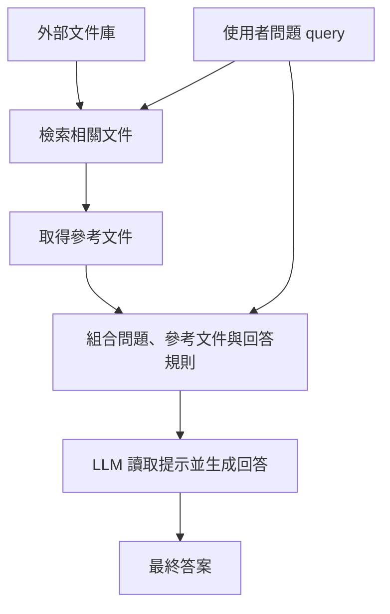
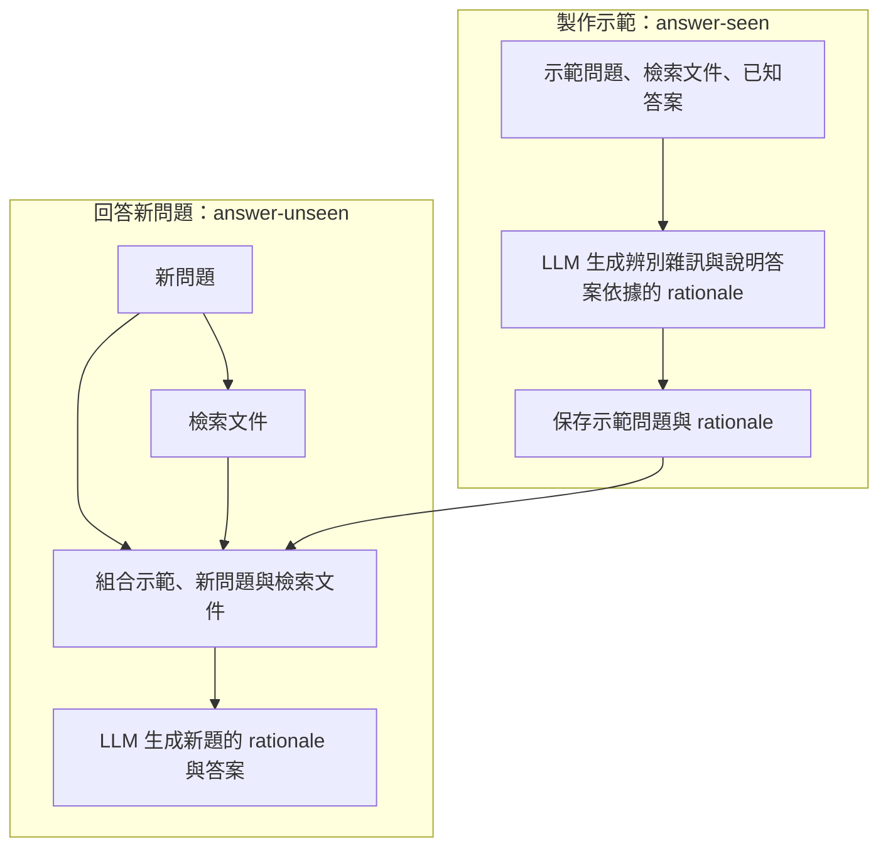
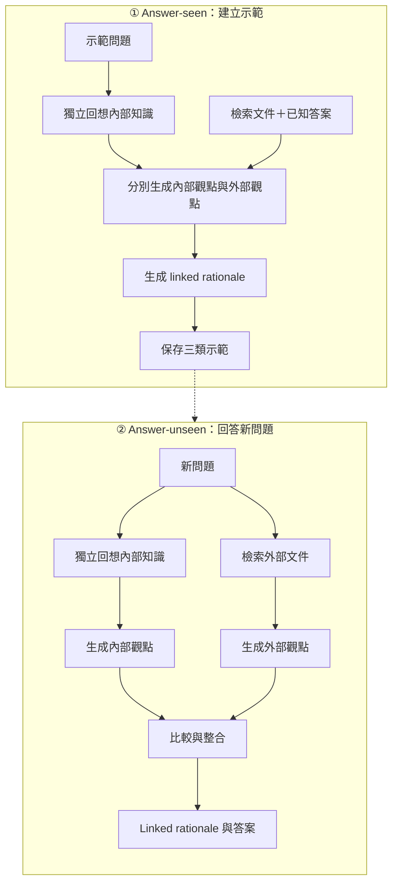

# RAG

# InstructRAG

# IDEAL-RAG

## conclusion

三者都能使用模型原有知識與外部文件。基本 RAG 將檢索文件提供給模型回答；InstructRAG 透過生成的 rationale 示範或微調，引導模型辨別雜訊；IDEAL-RAG 進一步明確拆開內部知識回想、內外觀點生成，以及最後的連結整合。差異在於如何組織與引導知識使用，不是有沒有參數知識。
