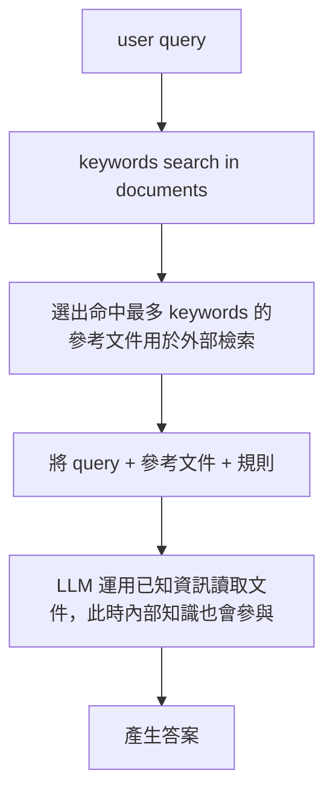
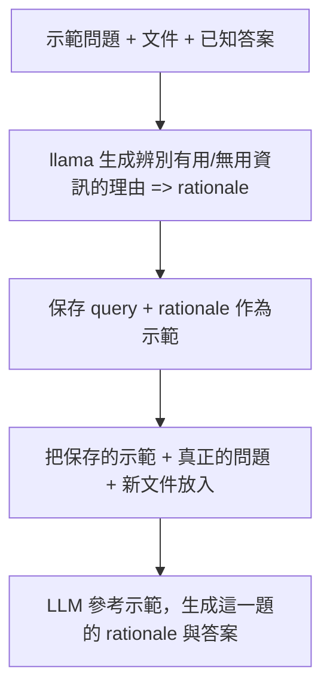

normal RAG

```mermaid
flowchart TD
    A[user query] --> B[keywords search in documents]
    B --> C[選出命中最多 keywords 的參考文件用於外部檢索]
    C --> D[將 query + 參考文件 + 規則]
    D --> E[LLM 運用已知資訊讀取文件，此時內部知識也會參與]
    E --> F[產生答案]
```

instruct rag

```mermaid
flowchart TD
    A[示範問題 + 文件 + 已知答案] --> B[llama 生成辨別有用/無用資訊的理由 => rationale ]
    B --> C[保存 query + rationale 作為示範]
    C --> D[把保存的示範 + 真正的問題 + 新文件放入 ]
    D --> E[LLM 參考示範，生成這一題的 rationale 與答案]
```
